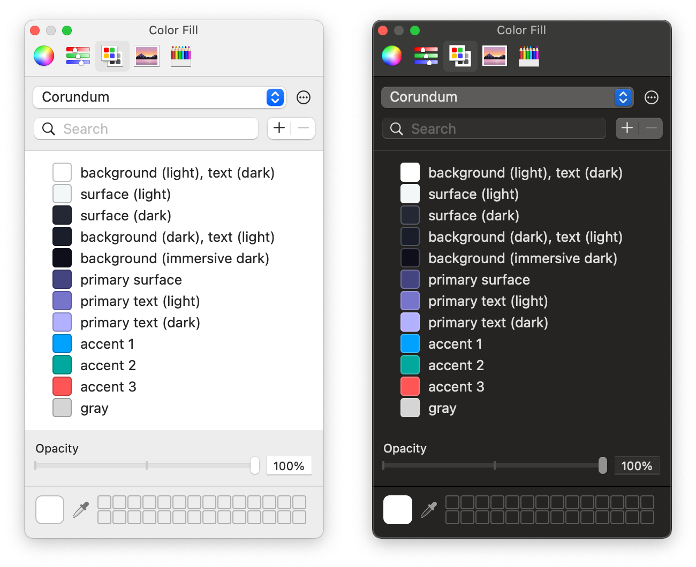

# Corundum

A color palette that works well in both light and dark themes.

## How to Install

Copy Corundum.clr into ~/Library/Colors/ or read [an instruction by GitHub](https://primer.style/presentations/assets/color-palette).

## License

[CC0](https://creativecommons.org/share-your-work/public-domain/cc0/). You can use Corundum for either personal or commercial purposes without credit.
